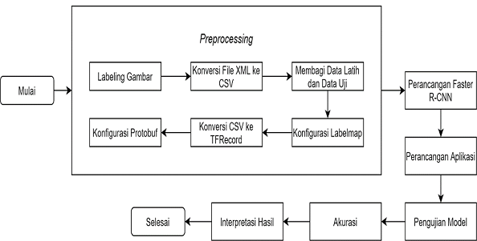

# DeteksiDaunMenjari
 Implementasi Deep Learning untuk Deteksi Daun Menjari Menggunakan Algoritma Faster R-CNN dengan Python dan Tensorflow Berbasis Dekstop

## Alur Tahapan Penelitian

## Flowchart dari Algoritma Faster R-CNN

